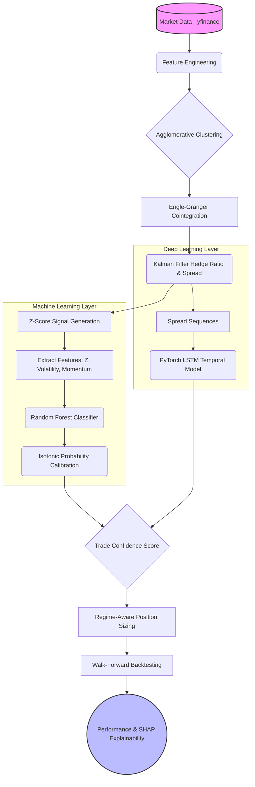

# 📈 Statistical + Machine Learning + Deep Learning Driven Pairs Trading System

<div align="center">
  
  
  
  
</div>

## 📖 Introduction

Welcome to the **End-to-End Quantitative Research System for Pairs Trading**. This project is not a black-box price prediction bot; it is an academically rigorous, production-style Machine Learning pipeline designed for Indian Equity Markets (NIFTY 50). 

It combines classical statistical arbitrage techniques with modern Machine Learning (ML) and Deep Learning (DL) to predict **trade quality**—specifically, whether a statistically valid mean-reverting spread will successfully revert within a fixed time horizon.

**Key Features:**
- **Robust Pair Selection:** Avoids multiple-testing bias by utilizing Agglomerative Clustering prior to Engle-Granger Cointegration tests.
- **Dynamic Hedging:** Employs a 1D Kalman Filter to dynamically update hedge ratios ($\beta$), minimizing structural break risks.
- **ML Trade Filtering:** Uses a Random Forest with Isotonic Calibration to output a probabilistic confidence score, distinguishing between true reversions and false breakouts.
- **Regime-Aware Sizing:** Detects high/low volatility regimes to scale positions dynamically, preserving capital during market turbulence.
- **Strict Walk-Forward Validation:** Prevents data leakage by training strictly out-of-sample on rolling windows.
- **Explainable AI (XAI):** Integrates SHAP to provide global feature importance and local trade interpretability.

---

## 🏗️ System Architecture

The pipeline flows from raw data ingestion to final trade execution and performance attribution.



---

## 📂 Folder Structure

The project is structured following clean-code and modular design principles, making it highly suitable for MLOps deployments and Quant Portfolios.

```text
Pairs Trading/
│
├── data/                       # Directory for caching historical market data
├── notebooks/
│   └── 01_pairs_trading_end_to_end.ipynb  # Main Jupyter notebook demonstrating the end-to-end pipeline
│
├── src/                        # Modular source code
│   ├── __init__.py             
│   ├── data_loader.py          # Data downloading and preprocessing (Yahoo Finance)
│   ├── pair_selection.py       # Clustering and Cointegration testing logic
│   ├── spread_model.py         # Kalman filter spread computation and Z-score signaling
│   ├── ml_filter.py            # Random forest trade quality modeling & Walk-forward validation
│   ├── dl_model.py             # PyTorch LSTM temporal spread forecasting
│   ├── backtest.py             # Regime detection, continuous PnL tracking, and Metrics calculation
│   └── explainability.py       # SHAP integration for model interpretability
│
├── run_backtest.py             # Headless execution script for running the pipeline in the terminal
├── Backtest_Run_Report.md      # Summary report of the latest backtest run
├── requirements.txt            # Python dependencies
└── README.md                   # Project documentation
```

---

## 🚀 Setup & Installation

**1. Clone the repository or navigate to the project directory:**
```bash
cd "Pairs Trading"
```

**2. Create a virtual environment (Recommended):**
```bash
python -m venv venv
# On Windows
venv\Scripts\activate
# On macOS/Linux
source venv/bin/activate
```

**3. Install the dependencies:**
```bash
pip install -r requirements.txt
```

---

## 💻 Instructions to Run

### Option A: Interactive Research Environment (Jupyter Notebook)
For an interactive experience featuring rich visualizations, Equity Curves, Drawdown charts, and SHAP Explainability plots, run the notebook:

1. Launch Jupyter:
   ```bash
   jupyter notebook
   ```
2. Navigate to `notebooks/` and open `01_pairs_trading_end_to_end.ipynb`.
3. Run all cells sequentially.

### Option B: Terminal / Headless Execution
To run the backtesting pipeline purely in the terminal and output the final Performance Metrics Dashboard (Total PnL, Sharpe, Win Rate, Drawdown, etc.):

```bash
python run_backtest.py
```

*Example Output:*
```text
--- STARTING PAIRS TRADING PIPELINE ---
...
========================================
      PERFORMANCE METRICS DASHBOARD     
========================================
Total PnL         : 21.07%
Total Trades      : 33
Max Drawdown      : 2.12%
Sharpe Ratio      : 1.99
Win Rate          : 60.61%
========================================
```

---

## ⚠️ Disclaimer
This project is an advanced demonstration of Machine Learning applications in quantitative finance. It is intended for educational, research, and portfolio purposes only. It does not constitute financial advice.
